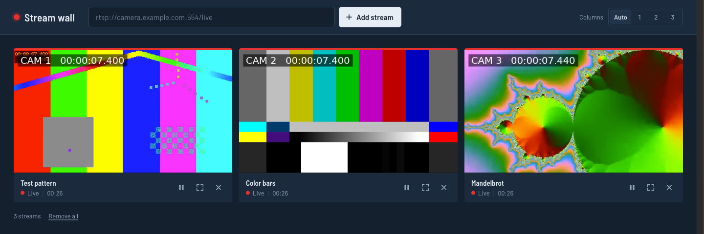

# RTSP Stream Viewer

Add RTSP camera URLs in the browser and watch them live, side by side.

- **Live demo:** _added after deployment_
- **Stack:** Go backend, React + TypeScript frontend, FFmpeg, WebSockets, Media Source Extensions



The demo comes with three test streams (click **Watch 3 demo streams**). They are served by a
MediaMTX instance running inside the backend container, so the deployment is self-contained.

> The demo backend runs on Render's free tier, which sleeps after 15 minutes without traffic.
> The first visit after a quiet period shows "Starting the server" for up to a minute.

## Features

- Add any `rtsp://` or `rtsps://` URL; the server checks it before a tile is created.
- Responsive grid with automatic or fixed (1/2/3) columns; full screen per tile.
- Play/pause per stream. Pause keeps the last frame; play resumes at live, not where you left off.
- Clear per-tile states: connecting, live (with time on air), reconnecting with the reason, and failed.
- Streams and layout are remembered in the browser.
- Automatic reconnection on both sides: the server restarts FFmpeg with backoff, the browser
  reconnects its WebSocket with backoff.

## Architecture

```
 Browser                                   Go server (one container)
 ┌───────────────────────┐   WebSocket     ┌────────────────────────────────────────────┐
 │ StreamTile × N        │  /ws?url=rtsp…  │ api: validate URL (SSRF) → subscribe       │
 │  MsePlayer            │ ◄────────────── │                                            │
 │   MediaSource         │  text: status,  │ stream.Manager   map[url]*Stream           │
 │   SourceBuffer        │        codec    │   one Stream per unique URL                │
 │   <video>             │  binary: fMP4   │   ├─ ffmpeg -c:v copy → fMP4 on stdout     │
 └───────────────────────┘  segments       │   ├─ SegmentReader: init | moof+mdat       │
                                           │   └─ fan-out to every subscriber           │
                                           │                                            │
                                           │ MediaMTX (127.0.0.1:8554) ◄ demo publishers│
                                           └──────────────┬─────────────────────────────┘
                                                          │ RTSP over TCP
                                                   external cameras
```

### Why fragmented MP4 over WebSocket + MSE

The brief requires FFmpeg and WebSockets. Within that, the three usual options are:

| Approach | Server CPU | Quality | Client |
|---|---|---|---|
| MPEG-1 + JSMpeg | Re-encode per stream | Low | JS decoder on canvas |
| MJPEG frames | Re-encode per stream | Medium, high bandwidth | Images on canvas |
| **H.264 → fMP4 (chosen)** | **Remux only (`-c:v copy`)** | **Original** | **Native `<video>` via MSE** |

Remuxing does not decode or encode video, so one FFmpeg process costs a few percent of a CPU
core. That is what makes several streams fit on a 0.1 CPU free instance, and the browser's
hardware decoder does the rest.

### Wire protocol

```
text    {"type":"status","state":"connecting|live|reconnecting|failed","message":"…"}
text    {"type":"init","codec":"avc1.4d401e"}   followed by one binary init segment (ftyp+moov)
binary  media segment (moof+mdat), appended as-is to the SourceBuffer
text    {"type":"error","message":"…"}          followed by a close with an application code
```

Errors travel over the socket because browsers do not expose the HTTP response of a rejected
WebSocket handshake to page scripts. Close codes: `4400` invalid URL (not retried), `4429` stream
limit reached, `4408` connection too slow, `4410` stream closed by the server.

### Scalability and performance

- **One FFmpeg per URL, not per viewer.** Every viewer of a camera shares the same process and the
  same bytes. Ten viewers of one camera cost one RTSP session to the camera.
- **Instant join.** FFmpeg runs with `frag_keyframe`, so every media segment starts on a keyframe.
  The server caches the init segment and the latest segment and sends both to a new viewer,
  so video starts immediately instead of waiting for the next keyframe.
- **Slow viewers can't hold others back.** Broadcasting never blocks. A viewer whose buffer is full
  skips whole segments (keyframe aligned, so no corruption) and is disconnected if it stays
  stuck for 10 seconds.
- **Idle grace.** A source keeps running for 30 s after its last viewer leaves, so refreshes and
  quick pause/play don't restart FFmpeg.
- **Bounded resources.** `MAX_STREAMS` caps distinct sources (default 6, sized for 512 MB). The
  browser keeps about 10 s of video per tile and removes older data, so memory stays flat.
- **Low-latency playback without stalls.** Segments are one GOP long and arrive whole, so the
  player trails the newest frame by about one segment, speeds up slightly (1.08×) to absorb
  drift, and jumps forward only if it falls more than 4 s behind (for example in a background tab).

Measured locally with Docker limited to Render's free tier (`--cpus=0.1 --memory=512m`), three
demo streams plus three viewers: about 9% of one core and 116 MB, with all streams keeping up in
real time. Playback stalls over 30 s fell from up to 7 to at most 1 after tuning the live-edge
target.

**Scaling out.** The service holds per-URL state in memory, so horizontal scaling needs routing
by stream: consistent-hash the URL to an instance at the load balancer (or a small directory
service) so all viewers of a camera land on the instance that runs its FFmpeg. For many viewers
per camera, put a CDN-friendly format (LL-HLS) next to the WebSocket path.

### Error handling

| Situation | What the viewer sees |
|---|---|
| Malformed URL, wrong scheme | Inline form error, no tile created |
| Private, loopback or cloud-metadata address | Inline form error explaining why |
| Camera refuses, times out, 401, 404 | Tile shows "Waiting for camera" with the reason; server retries 1 s → 30 s |
| Camera connects but sends nothing for 10 s | Watchdog kills FFmpeg and retries |
| FFmpeg restarts (new timestamps or resolution) | Player rebuilds its decoder on the new init segment |
| Non-H.264 stream (e.g. H.265) | Tile shows "Can't play this stream" with the codec; no retry loop |
| Browser can't decode the codec, or has no MSE | Tile or page explains it |
| Backend asleep or unreachable | Banner while it wakes; WebSockets reconnect with backoff |
| Server at its stream limit | Tile explains and retries |

### Security

The server opens a connection to whatever URL a user types, so it would be an SSRF proxy into
the hosting network if left unchecked. URLs must be `rtsp://` or `rtsps://`, and every resolved
address must be public: loopback, private, link-local (including `169.254.169.254`), CGNAT and
multicast ranges are rejected. The bundled demo server is allowed by exact `host:port`
(`ALLOWED_RTSP_HOSTS=127.0.0.1:8554`). FFmpeg is started with an argument list, never a shell.
Credentials in URLs are redacted from logs and masked in the UI. WebSocket and CORS access is
restricted to `ALLOWED_ORIGINS`.

Known limitation: validation resolves DNS before FFmpeg connects, so DNS rebinding between the
two lookups is not prevented. Closing that gap means resolving once and handing FFmpeg the IP,
which breaks RTSPS certificate checks and some cameras' Host-based routing, so it was left out.

## Run locally

### With Docker (recommended)

```sh
docker compose up --build
```

Open http://localhost:5173 and click **Watch 3 demo streams**. The compose file also sets
`ALLOW_PRIVATE_NETWORKS=true`, so you can add cameras on your own network
(`rtsp://192.168.x.x/...`).

### Without Docker

Requirements: Go 1.26+, Node 22.12+, FFmpeg 5+, MediaMTX (`brew install ffmpeg mediamtx`).

```sh
# 1. Demo RTSP server and three looping test streams on rtsp://127.0.0.1:8554/cam1..3
mediamtx demo/mediamtx.yml &
./demo/publish.sh &

# 2. Backend on :8080
cd backend
DEMO_STREAMS="Test pattern=rtsp://127.0.0.1:8554/cam1,Color bars=rtsp://127.0.0.1:8554/cam2,Mandelbrot=rtsp://127.0.0.1:8554/cam3" \
ALLOWED_RTSP_HOSTS=127.0.0.1:8554 \
go run ./cmd/server

# 3. Frontend on :5173
cd frontend
npm ci
npm run dev
```

### Publishing your own test stream

Any H.264 file can be pushed into the local MediaMTX:

```sh
ffmpeg -re -stream_loop -1 -i my-video.mp4 -c:v libx264 -g 25 -an \
  -f rtsp -rtsp_transport tcp rtsp://127.0.0.1:8554/mystream
```

Then add `rtsp://127.0.0.1:8554/mystream`. A short GOP (`-g` ≈ frame rate) keeps latency near
one second, because a media segment is one GOP long.

## Configuration

Backend environment variables:

| Variable | Default | Purpose |
|---|---|---|
| `PORT` | `8080` | HTTP port |
| `ALLOWED_ORIGINS` | `localhost:*,127.0.0.1:*` | Comma-separated browser origins for WebSocket/CORS. Patterns use `path.Match`; include the scheme to match it exactly (`https://app.example.com`) |
| `MAX_STREAMS` | `6` | Maximum distinct RTSP sources running at once |
| `IDLE_GRACE` | `30s` | How long a source keeps running after its last viewer leaves |
| `ALLOWED_RTSP_HOSTS` | (empty) | `host:port` pairs exempt from the private-address check |
| `ALLOW_PRIVATE_NETWORKS` | `false` | Allow private/LAN cameras (local use only) |
| `DEMO_STREAMS` | (empty) | `Name=url,Name=url` offered by the UI's demo button |
| `FFMPEG_PATH` | `ffmpeg` | FFmpeg binary |
| `ENABLE_DEMO` | `true` (container) | Start the bundled MediaMTX and publishers |

Frontend build variable: `VITE_API_URL`, the backend base URL (default `http://localhost:8080`).

## Tests

```sh
cd backend && go test -race ./...
cd frontend && npm test && npm run typecheck
```

The backend tests cover URL validation and SSRF cases. They run the MP4 segmenter against a real
FFmpeg capture, and test the stream manager with a fake source: fan-out, late join, stream limit,
idle grace, reconnect, terminal codec errors, the stall watchdog and slow-viewer handling. They
also exercise the WebSocket API end to end. Browser playback was verified manually with
Playwright, including the CPU-limited run above.

## Deployment (Render)

`render.yaml` is a Render Blueprint with two free services:

- `rtsp-viewer-api`: Docker web service built from `Dockerfile` (Go server, FFmpeg, MediaMTX demo).
- `rtsp-viewer`: static site built from `frontend/`.

In Render choose **New → Blueprint** and select this repository. Render derives URLs from service
names. If a name is taken, Render adds a suffix; update `VITE_API_URL` (static site) and
`ALLOWED_ORIGINS` (API) to the real URLs and redeploy.

Render's free tier cannot receive private-network traffic, which is why the demo MediaMTX runs
inside the API container on loopback instead of as its own service.

## Trade-offs and limitations

- **H.264 only.** H.265 cameras are detected and rejected with a clear message. Browser HEVC
  support through MSE is inconsistent, and transcoding would not fit a 0.1 CPU instance. With
  more CPU, a transcode fallback (`-c:v libx264 -preset veryfast -tune zerolatency`) is a one-line
  change in `stream/ffmpeg.go`.
- **Video only.** Audio is dropped; tiles on a monitoring wall are muted anyway.
- **Latency ≈ one GOP + about 1 s.** Cameras with long keyframe intervals have proportionally
  higher latency. WebRTC would cut that to sub-second, but it is outside the brief's
  FFmpeg-over-WebSocket requirement.
- **No authentication.** Anyone with the link can add streams. A production deployment needs
  user accounts or at least a shared secret, plus per-client rate limits.

## Project layout

```
backend/
  cmd/server/          configuration, HTTP server, graceful shutdown
  internal/api/        HTTP + WebSocket handlers, URL validation
  internal/stream/     FFmpeg source, fMP4 segmenter, stream fan-out manager
demo/                  MediaMTX config, publisher script, sample clips
docker/entrypoint.sh   starts MediaMTX, publishers and the server
frontend/src/
  lib/msePlayer.ts     WebSocket + Media Source Extensions player
  components/          wall UI: form, grid tiles, layout toggle
  hooks/               persisted stream list, server health
Dockerfile, docker-compose.yml, render.yaml
```
